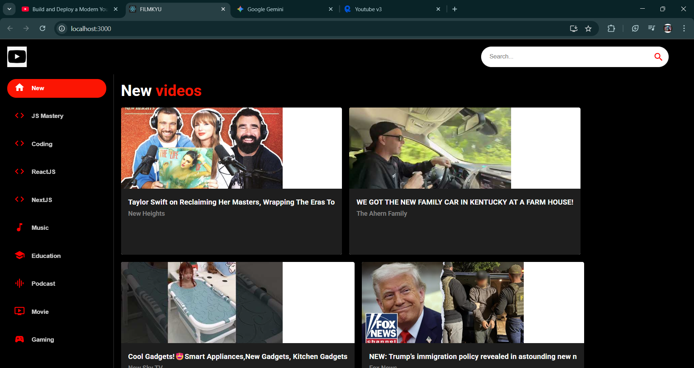

# YouTube Clone (Proyek Capstone) 🚀

Aplikasi web ini adalah kloningan YouTube yang dibuat sebagai Capstone Project untuk program Hacktiv8 Student Developer Initiative. Aplikasi ini memungkinkan pengguna untuk menelusuri, melihat, dan menemukan video menggunakan data dari YouTube v3 API via RapidAPI.

*This web application is a YouTube clone built as a Capstone Project for the Hacktiv8 Student Developer Initiative program. It allows users to browse, view, and discover videos using data from the YouTube v3 API via RapidAPI.*

---

### Screenshot 📸

[Di sini tempat kamu menaruh screenshot aplikasimu]


---

### Fitur ✨

* **Browse Video:** Menampilkan video populer saat halaman pertama kali dimuat.
* **Kategori:** Sidebar untuk memilih video berdasarkan kategori (Coding, Music, Gaming, dll.).
* **Fungsi Pencarian:** Mencari video berdasarkan kata kunci.
* **Desain Responsif:** Tampilan yang menyesuaikan dengan berbagai ukuran layar.

* **Video Browsing:** Displays popular videos on initial load.
* **Categories:** A sidebar to select videos based on categories (Coding, Music, Gaming, etc.).
* **Search Functionality:** Search for videos using keywords.
* **Responsive Design:** The layout adapts to different screen sizes.

---

### Teknologi yang Digunakan 💻

* **React.js** (Library Frontend)
* **Material UI v5** (Komponen UI)
* **React Router v6** (Navigasi Halaman)
* **Axios** (HTTP Client untuk memanggil API)
* **RapidAPI** (Platform untuk mengakses YouTube v3 API)

---

### **Setup & Cara Menjalankan Lokal** 🚀

Untuk menjalankan proyek ini di komputermu, ikuti langkah-langkah berikut:

*To run this project on your local machine, follow these steps:*

1.  **Clone Repository Ini**
    ```bash
    git clone [https://github.com/NAMAGITHUBMU/NAMAREPOMU.git](https://github.com/NAMAGITHUBMU/NAMAREPOMU.git)
    ```

2.  **Masuk ke Direktori Proyek**
    ```bash
    cd NAMA-REPO-MU
    ```

3.  **Install Dependencies**
    ```bash
    npm install
    ```

4.  **Dapatkan API Key**
    * Kamu butuh API Key untuk menjalankan aplikasi ini.
    * Daftar/Login di [RapidAPI](https://rapidapi.com).
    * Cari dan *subscribe* ke API **"YouTube v3"** oleh `youtube-v31`.
    * Kamu akan mendapatkan `X-RapidAPI-Key`.
    ---
    * *You will need an API Key to run this application.*
    * *Sign up or log in at [RapidAPI](https://rapidapi.com).*
    * *Search for and subscribe to the **"YouTube v3"** API by `youtube-v31`.*
    * *You will get an `X-RapidAPI-Key`.*

5.  **Buat file `.env`**
    * Salin file `.env.example` menjadi file baru bernama `.env`.
    * Buka file `.env` dan masukkan API Key-mu.
        ```
        REACT_APP_RAPID_API_KEY=MASUKKAN_API_KEY_KAMU_DI_SINI
        ```
    * *Copy the `.env.example` file to a new file named `.env`.*
    * *Open the `.env` file and insert your API Key.*

6.  **Jalankan Aplikasi**
    ```bash
    npm start
    ```
    Aplikasi akan berjalan di `http://localhost:3000`.